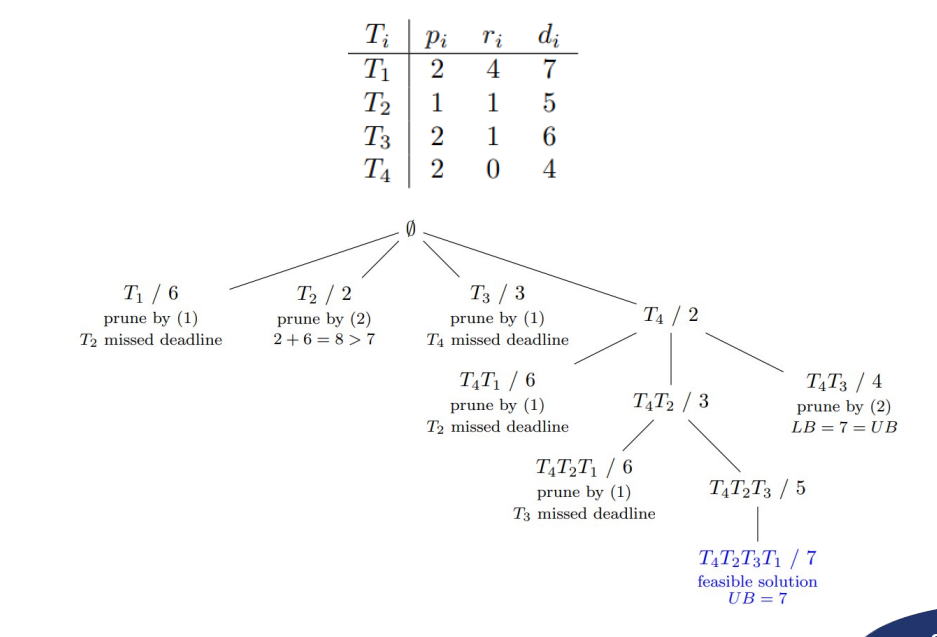
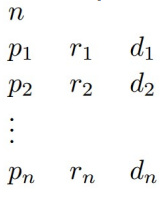
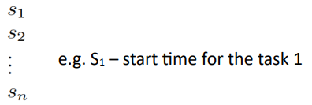
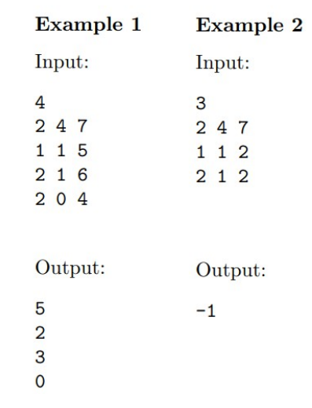

# HW3 - Parallel Branch and Bound: Bratley Algo

## 1 Script

```sh
cmake * # install dependecies
make # compile binnary
mpirun -np 4 ./Main # run binary woth mpi
cmake && make && mpirun -np 4 ./Main # compile binay and run it
```

## 2 Assigement

The task is to implement parallel branch-and-bound algorithm for Bratley’s problem using MPI. There are 3 elimination rules:

### 2.1 Missed deadline

It might happen that unassigned task would miss its deadline when assigned to the current schedule, if that is the case, prune this node.

*It is meaningless to continue, because in the future, some task would surely miss its deadline.*

$(\forall T_j \in V : \max\{c, r_j\} + p_j > d_j )$ => prune this node

- $c$ – length of the partial schedule
- $V$ – a set of non-scheduled tasks

## 2.2 Bound on the solution

We might have already found some feasible solution, which might not be optimal. However, we can use its quality as an upper bound (`UB`). We can calculate lover bound (`LB`) of the current solution and prune this node if `LB ≥ UB`.

$LB = \max\{c, \min_{T_j \in V}\{r_j\}\} + \sum_{T_j \in V}{p_j}$

- $c$ – length of the partial schedule
- $V$ – a set of non-scheduled tasks

## 2.3 Decomposition

We might be able to detect, that the partial solution we have in the current node is optimal, therefore it might not be necessary to backtrack.

$(c \leq \min_{T_j \in V}\{r_j\} )$ => prune this node

- $c$ – length of the partial schedule
- $V$ – a set of non-scheduled tasks



## 2.4 Resources for algorithm

- https://www.youtube.com/watch?v=kbQ0J6I72Ww
- https://cw.fel.cvut.cz/b202/_media/courses/ko/12_bratley.pdf

## 2.5 Hints

### 2.5.1 Use stack instead of recursion

- Current schedule can be implemented as vector
- Vector size represents the the depth of algorithm
- Send only the current schedule between the processes

### 2.5.2 You can use master-slave

- Some inspiration can be found in codes from 2nd MPI seminar

### 2.5.3 Use dynamic load balancing

- For termination you can use Dijkstra's Token
- See Combinatorial Algorithms lecture

### 2.5.4 Notest from lab

- používat dequeue (doublle queue, moci pracovat s front tak i s back) jako stack
- cteni ze souboru neni treba paralelizovat
- nesortovat tasky
- jet smyccku (`white(!stack.empty())`) a vykonávat Bratley
    - Leaf - Cmax MPI_iSend
    - 2 bounding - hole - nasli jsme diru, dat vedet pomoci iSend
    - treba osetrit croos block, tj. co kdyz oba dva najdou optimalni reseni, je dobre si zapamatovat hloubku, vetsi hloubka, asi lepsi - dobre implementovat vlatni protokol na posilani zprav
- typy zprav
    - `leaf` nalezeno reseni (leaf)
    - `hole` nalezeno optimum (dira hole)
    - `working_request` zadost o praci (v momnete, kdyz uz nemam co dalsiho delat)
    - `token` dijstruv token, kdyz je node v waiting loope, posilam token dale dokud se mi nevrati moje barva
    - `finish`
- message_handeling - pro prijimani funkci
- idealne pripravit vlastni strukturu zpravy
- `MPI_Iprobe()` - prijimani a handelovani zprav
- dobre si pamatovat hloubku pri rozdelovani prace, pro zpetnou reprezentaci

## 2.6 Inputs and outputs

- Your program will be called with two arguments 
  - The first one is absolute path to input file
  - The second one is the absolute path to output file which has to be created by your program. 
- Let $n$ be the number of tasks. Then the input file has $n + 1$ lines 
and has the following form:



- If the input instance is infeasible, then the output file consists of the single line containing $−1$. For feasible instance, then the output file consists of n lines with start time of each task and has the following form:




## 2.7 Examples

